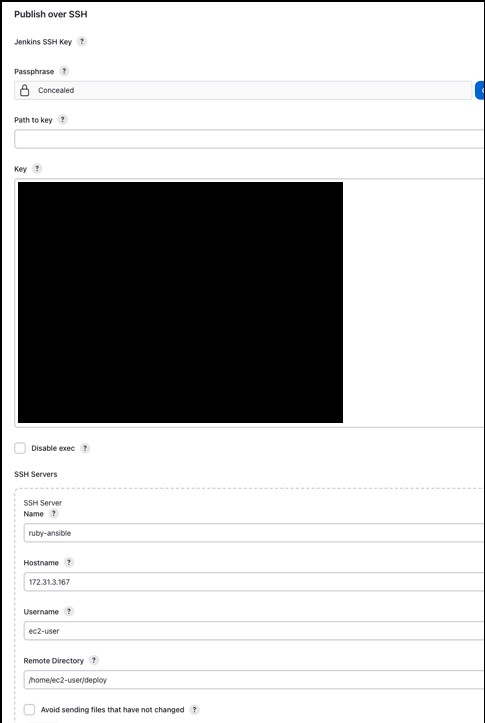
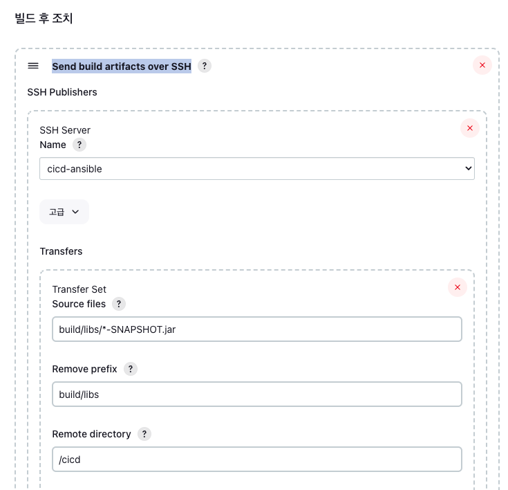

## Ansible
- 여러 개의 서버를 효율적으로 관리할 수 있게 해주는 환경 구성 자동화 도구
  - Configuration Management, Deployment & Orchestration tool
  - IT Infrastructure 자동화
  - apt-get, yum, homebrew 등을 통한 설치, 파일 및 스크립트 배포, 다운로드, 실행을 자동화

### Ansible 설치
```shell
# dnf 패키지 업데이트
sudo dnf update

sudo dnf install python3-pip

# Ansible 설치
pip install ansible

# 버전 확인
ansible --version
```

### Jenkins 에서 Ansible 서버에 빌드 파일 전송
1. Jenkins Publish over SSH 플러그인 설치 및 설정
   - Publish over SSH
     - SSH 프로토콜을 통해 지정한 서버에 빌드된 파일을 배포할 수 있는 플러그인
2. Publish over SSH Jenkins SSH Key 등록
   - Jenkins 관리 - Publish over SSH 
      *Ansible Server 환경이 AWS EC2 인스턴스라면 인스턴스에 등록한 키페어 파일의 키값을 등록한다.*
3. 프로젝트 - 빌드 후 조치 - Send build artifacts over SSH 설정
    
4. Ansible 서버에 빌드 파일을 받을 경로의 디렉터리 생성
    ```shell
    cd /home/ec2-user
    mkdir /home/ec2-user/deploy
    mkdir /home/ec2-user/deploy/cicd
    ```