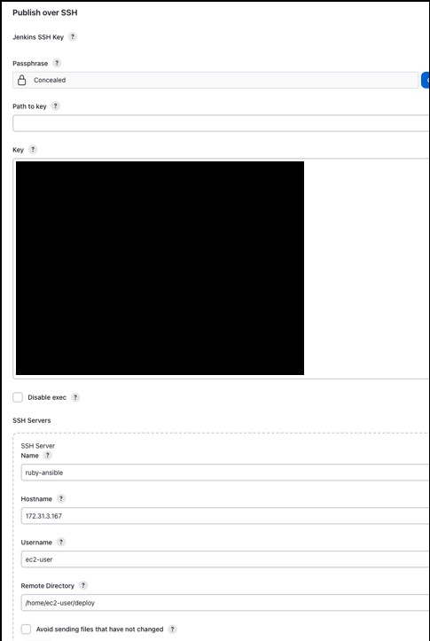
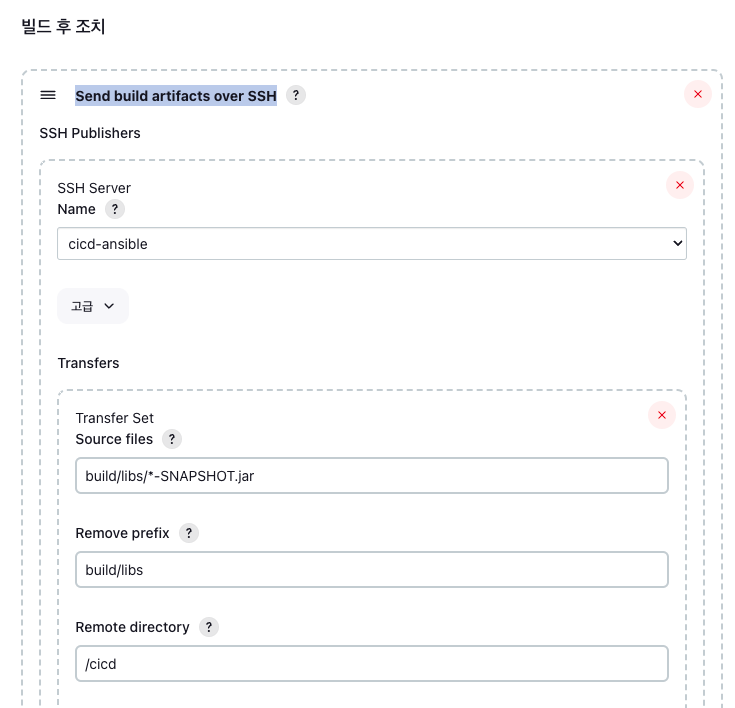

## Ansible
- 여러 개의 서버를 효율적으로 관리할 수 있게 해주는 환경 구성 자동화 도구
  - Configuration Management, Deployment & Orchestration tool
  - IT Infrastructure 자동화
  - apt-get, yum, homebrew 등을 통한 설치, 파일 및 스크립트 배포, 다운로드, 실행을 자동화

### Ansible 설치
```shell
# dnf 패키지 업데이트
sudo dnf update

sudo dnf install python3-pip

# Ansible 설치
pip install ansible

# 버전 확인
ansible --version
```

### Jenkins 에서 Ansible 서버에 빌드 파일 전송
1. Jenkins Publish over SSH 플러그인 설치 및 설정
   - Publish over SSH
     - SSH 프로토콜을 통해 지정한 서버에 빌드된 파일을 배포할 수 있는 플러그인
2. Publish over SSH Jenkins SSH Key 등록
   - Jenkins 관리 - Publish over SSH 
      *Ansible Server 환경이 AWS EC2 인스턴스라면 인스턴스에 등록한 키페어 파일의 키값을 등록한다.*
3. 프로젝트 - 빌드 후 조치 - Send build artifacts over SSH 설정
    
4. Ansible 서버에 빌드 파일을 받을 경로의 디렉터리 생성
    ```shell
    cd /home/ec2-user
    mkdir /home/ec2-user/deploy
    mkdir /home/ec2-user/deploy/cicd
    ```
   
### 빌드 파일을 통해 Docker Image 생성 및 배포
1. Ansible 서버에 빌드 파일을 받을 경로에 Dockerfile 추가
    ```dockerfile
    FROM openjdk:17-jdk-slim

    VOLUME /tmp
    
    COPY ruby-cicd-0.0.1-SNAPSHOT.jar ruby-cicd.jar
    
    EXPOSE 8080
    
    ENTRYPOINT ["java","-jar","ruby-cicd.jar"]
    ```
2. 같은 경로에 Image 생성 및 Push 를 실행할 스크립트 작성 (ECR 을 이미지 저장소로 사용)
    ```shell
    #!/bin/sh
    # 스크립트 파일 : cicd-image.sh
    
    REPOSITORY_URL=827022744220.dkr.ecr.ap-northeast-2.amazonaws.com
    REPOSITORY_NAME=ruby-cicd
    EXECUTE_PATH=/home/ec2-user/deploy/cicd
    
    # 빌드 파일 저장 경로로 이동
    cd $EXECUTE_PATH
    
    # AWS ECR 자격증명. aws configure 설정을 먼저 해준 후 실행
    aws ecr get-login-password --region ap-northeast-2 | docker login --username AWS --password-stdin $REPOSITORY_URL
    
    # 오늘 날짜
    TODAY=$(date +%Y%m%d%H%M%S)
    
    # dockerfile 을 실행하여 이미지 빌드
    docker build -t $REPOSITORY_NAME .
    
    # 이미지 태그
    docker tag $REPOSITORY_NAME:latest $REPOSITORY_URL/$REPOSITORY_NAME:$TODAY
    
    # ECR 에 이미지 Push
    docker push $REPOSITORY_URL/$REPOSITORY_NAME:$TODAY
    
    # Push 후 이미지 삭제
    docker rmi $(docker images -q)
    
    # 빌드 파일 삭제
    rm $REPOSITORY_NAME-*.jar
    
    # 배포 스크립트의 이미지 태그 부분 변경
    sed -i "s/:[0-9]*/:$TODAY/g" $EXECUTE_PATH/cicd-deploy.sh
    sed -i "s/80:[0-9]*/80:8080/g" $EXECUTE_PATH/cicd-deploy.sh
    ```
    *chmod +x scriptfile 을 통해 스크립트 파일에 실행 권한 부여*
3. Application Server 에서 실행시킬 스크립트 작성
    ```shell
    #!/bin/sh
   
    # 스크립트 파일 : cicd-deploy.sh
    
    # IAM
    export AWS_ACCESS_KEY_ID=ACCESS_KEY_ID
    export AWS_SECRET_ACCESS_KEY=SECRET_ACCESS_KEY
    export AWS_DEFAULT_REGION=ap-northeast-2
    
    REPOSITORY_URL=827022744220.dkr.ecr.ap-northeast-2.amazonaws.com
    REPOSITORY_NAME=ruby-cicd
    
    # 기존에 실행중인 컨테이너 중지 및 삭제
    docker rm -f $(docker ps -qa)
    
    # 기존에 있던 이미지 삭제
    docker rmi $(docker images -q)
    
    # ECR Login
    aws ecr get-login-password --region ap-northeast-2 | docker login --username AWS --password-stdin $REPOSITORY_URL
    
    # 새 이미지 pull / 백그라운드로 실행. 외부 80번 포트와 컨테이너 연결
    docker run -d -p 80:8080 --name api $REPOSITORY_URL/$REPOSITORY_NAME:20230909143136
    ```
4. Ansible Server 에서 접속할 다른 EC2 IP(Application Server IP) 등록
    ```shell
    mkdir /etc/ansible

    # 해당 경로애 hosts 파일 작성
    sudo vi /etc/ansible/hosts
    
    [Group Name]  #group 명
    xxx.xx.x.x    # EC2 public ip - Ansible Server 와 Application Server 의 환경이 모두 AWS 라면 Private IP 를 입력해도 된다.
    ```
5. Ansible Playbook 작성
    ```yaml
    - name: CICD Deploy
      hosts: CICD
      become: yes
      become_method: sudo
      vars:
        local_path: /home/ec2-user/deploy/cicd
        remote_path: /home/ec2-user/cicd
      tasks:
        - name: Create Derectory
          file:
            path: "{{ remote_path }}"
            owner: ec2-user
            state: directory
            mode: 0755
        - name: Script Send
          copy:
            src: "{{ local_path }}/cicd-deploy.sh"
            dest: "{{ remote_path }}/cicd-deploy.sh"
            owner: ec2-user
            mode: 0755
        - name: Script Run
          shell:
            cmd: "{{ remote_path }}/cicd-deploy.sh"
    ```
6. Jenkins Item 의 구성 - 빌드 후 조치 - Send build artifacts over SSH 에 Exec command 추가
    ```shell
    # 해당 경로로 이동
    cd /home/ec2-user/deploy/cicd

    # 이동한 경로에 배치되어 있는 스크립트 실행. 해당 스크립트를 통해 이미지 생성 및 ECR 에 이미지 Push
    ./cicd-image.sh
    
    # 이동한 경로에 배치되어 있는 Ansible Playbook 실행. Application Server 에 스크립트 파일을 전송한 후 실행
    # 스크립트 파일이 Application Server 에서 실행되며 그 결과로 이미지를 pull 및 컨테이너 실행
    ansible-playbook cicd-playbook.yml
    ```
7. Ansible Server 에서 다른 서버에 비밀번호 없이 접속하기 위한 key 설정
   - EC2 인스턴스에서 다른 인스턴스로 비밀번호 없이 ssh 접속하기 위한 설정
    ```shell
    # 키파일 생성
    ssh-keygen -t rsa
    
    # 키파일은 .ssh 디렉터리에 생성된다.
    cd /home/ec2-user/.ssh
    
    # 생성된 키파일 중 공개키 내용 출력. 출력된 내용을 복사
    cat id_rsa.pub
   
    # 접속할 다른 서버(Application Server)에서 .ssh 디렉터리 이동
    cd /home/ec2-user/.ssh
    
    # 접속할 다른 서버(Application Server)에서 해당 파일을 열어서 공개키 내용을 복사하여 등록한다.
    vi /home/ec2-user/.ssh/authorized_keys
    ```