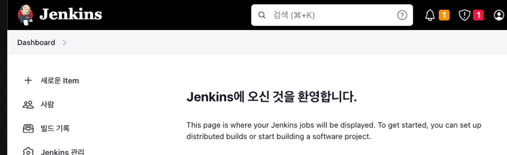
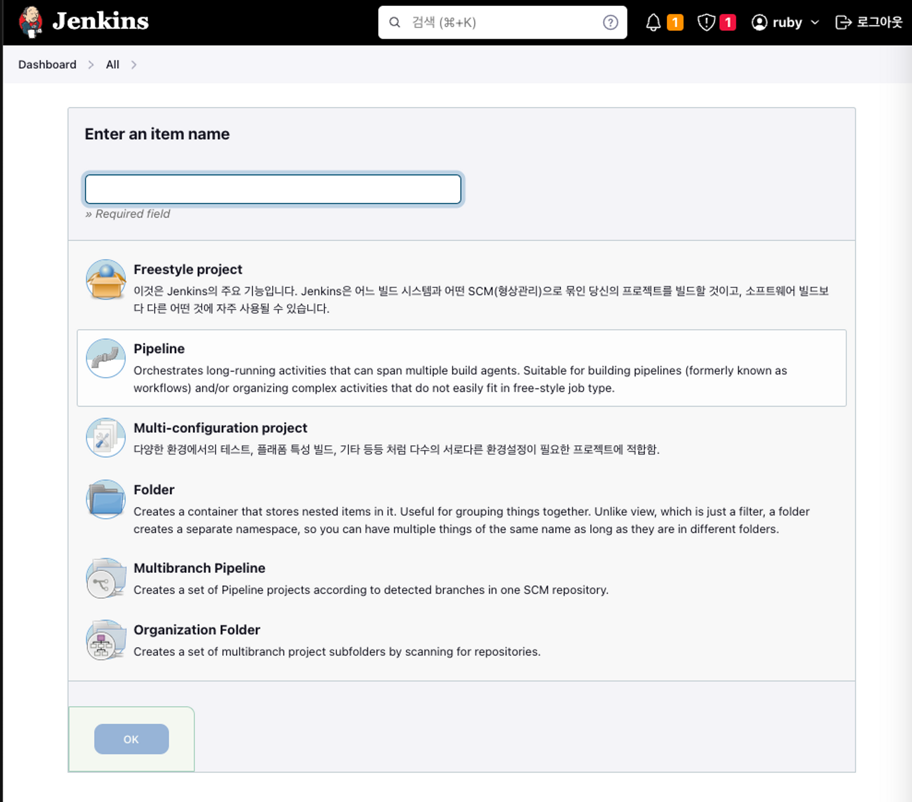
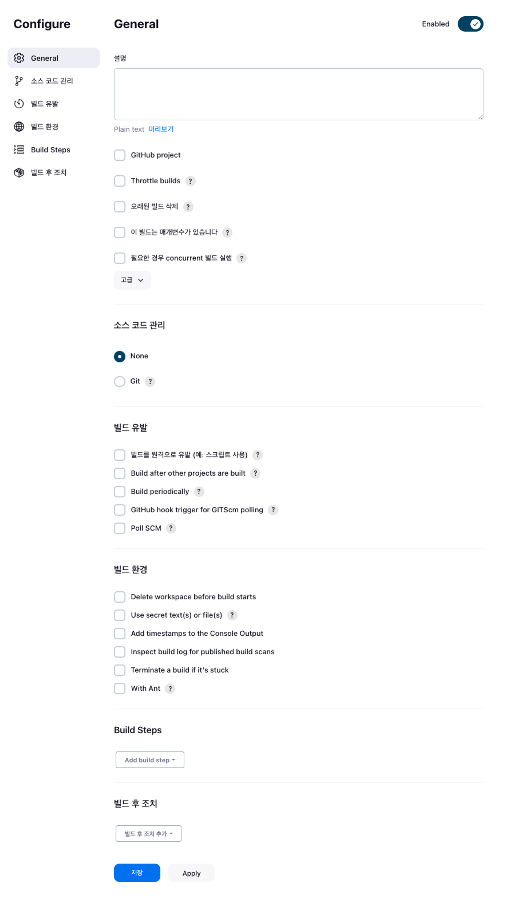
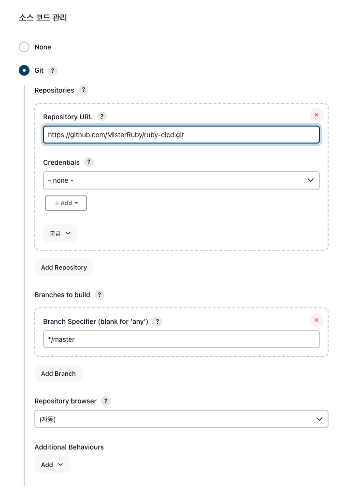
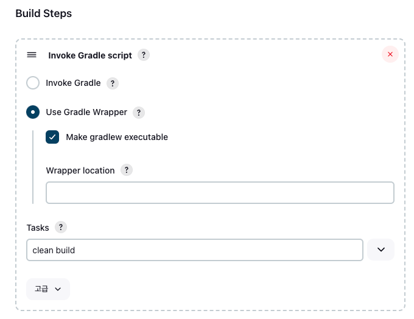
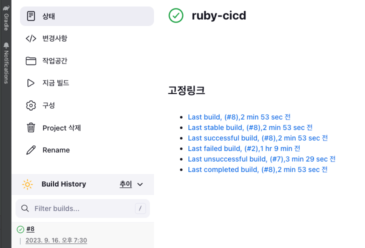

## Jenkins
- CI / CD Work Flow 를 설계 및 제어하는 도구
- JVM 위에서 실행되는, 자바 언어로 만들어진 애플리케이션

### Jenkins 설치
1. Docker 를 통해 이미지 Pull
   ```shell
   docker pull jenkins/jenkins:jdk17
   ```
2. 이미지를 통해 jenkins 컨테이너 생성
    ```shell
    docker run -d -v jenkins_home:/var/jenkins_home -p 80:8080 --restart=on-failure --name jenkins-server jenkins/jenkins:jdk17
   ```
3. 프로젝트 빌드에 필요한 JDK 를 Jenkins 컨테이너 내에 설치
   
   
### Jenkins 접속
1. 초기 비밀번호 확인
    ```shell
   docker logs jenkins-server
   ```
   
2. 초기 비밀 번호로 Jenkins 접속
   
3. 플러그인 추가 설치
4. 계정 생성
   

### Jenkins Item
- 젠킨스에서 관리하는 프로젝트의 단위. Item 단위로 프로젝트를 빌드, 테스트, 배포 등을 수행

### Jenkins Item 생성
1. 메뉴에서 새로운 Item 클릭
   
2. Item 생성
   
3. Item 추가 설정
   

### Jenkins - Github 연동
1. 생성된 Item - 구성 - 소스 코드 관리의 - Git 에서 빌드할 프로젝트를 Pull 하기 위한 설정
   
2. 빌드 유발
   
3. 설정 저장 후 빌드 실행
   