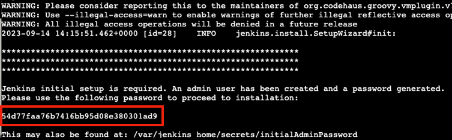
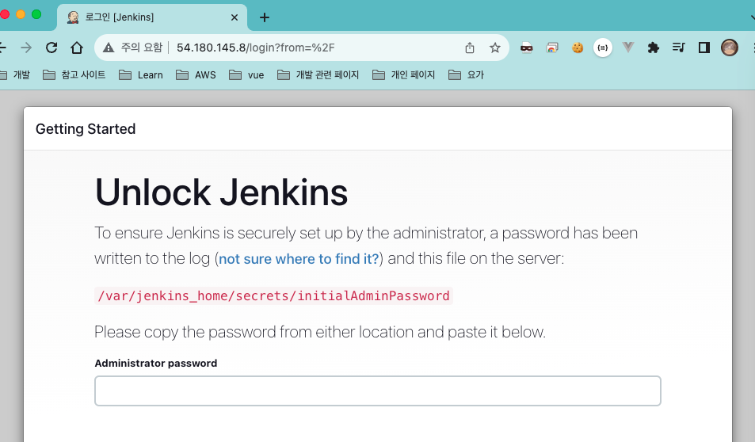
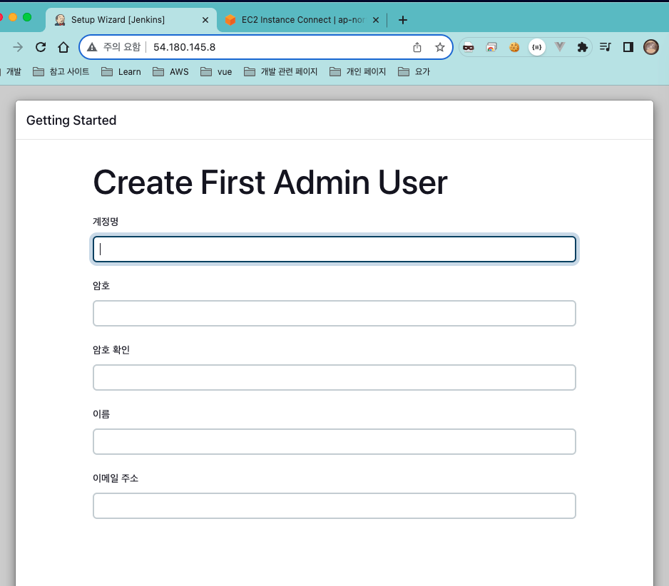

## Jenkins
- CI / CD Work Flow 를 설계 및 제어하는 도구
- JVM 위에서 실행되는, 자바 언어로 만들어진 애플리케이션

### Jenkins 설치
1. Docker 를 통해 이미지 Pull
   ```shell
   docker pull jenkins/jenkins
   ```
2. 이미지를 통해 jenkins 컨테이너 생성
    ```shell
    docker run -d -v jenkins_home:/var/jenkins_home -p 80:8080 -p 50000:50000 --restart=on-failure --name jenkins-server jenkins/jenkins
    ```
   
### Jenkins 접속
1. 초기 비밀번호 확인
    ```shell
   docker logs jenkins-server
   ```
   
2. 초기 비밀 번호로 Jenkins 접속
   
3. 플러그인 추가 설치
4. 계정 생성
   