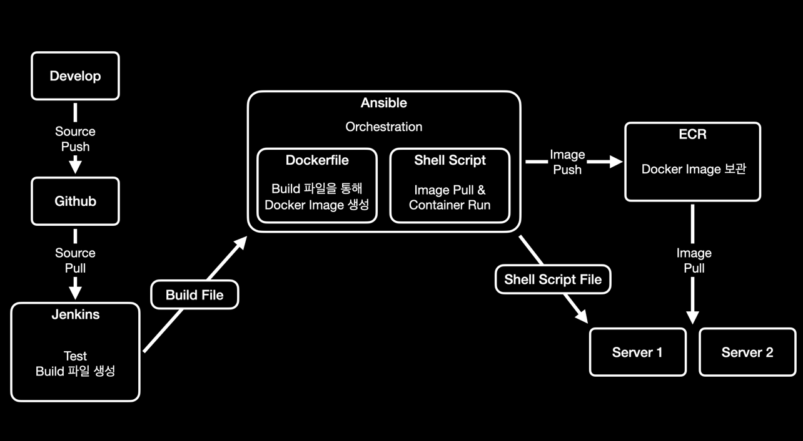

## CI - Continuous Integration
- 지속적 통합
- 코드가 merge 되었을 때마다 자동으로 빌드와 테스트를 수행함으로서 지속적 통합을 유지함
    - 작은 단위로 코드를 변경 및 merge 함으로서 충돌을 최소화
    - merge 전 또는 후에 빌드와 테스트를 통해 코드의 안정성을 확보함
        - 빌드 / 테스트 에러 발생시 개발자에게 통보

## CD - Continuous Deployment
- 지속적 배포
- CI 에서 빌드된 애플리케이션을 지속적으로 배포하는 과정
- 브랜치의 중요성에 따라 자동 배포를 하지 않는 경우도 있음
    - Develop 브랜치는 CI / CD 를 수행
    - Production 브랜치는 CI 까지만 수행하고 QA 를 거친 후에 수동 배포

## CI/CD 흐름도
